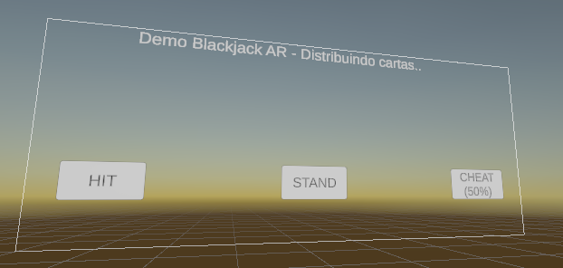
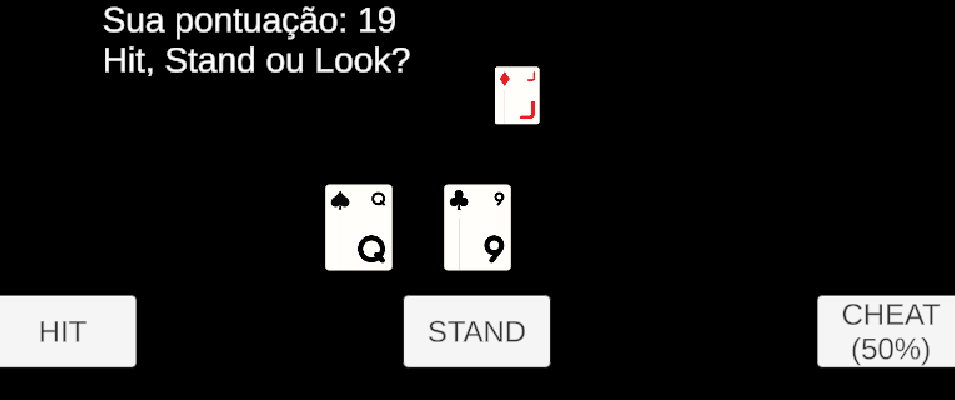
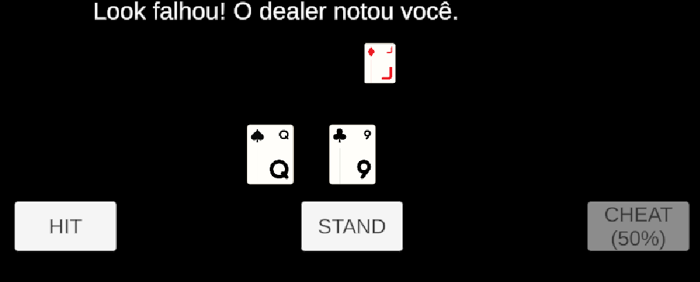
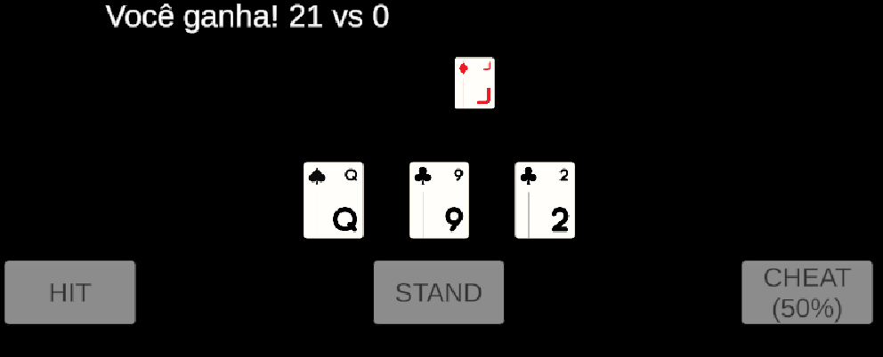

# Projeto de Jogo de Cartas em Realidade Aumentada (AR)

## Integrantes
- Anderson Hideki Suzuki — RA:22.01809-3
- Pedro Camasmie Kobayashi — RA:22.10121-7

## Descrição do Projeto

O projeto teve como base o desenvolvimento de um **jogo de cartas em Realidade Aumentada (AR)**, explorando mecânicas que só fazem sentido em jogos físicos, como **tentar ver as cartas do oponente** ou **embaralhar o baralho de forma vantajosa**.

Na **primeira entrega**, o objetivo era permitir que o jogador **posicionasse cartas em um plano vazio**. Porém, a mecânica de embaralhar as cartas foi descartada, pois a lógica de distribuição aleatória não estava funcionando corretamente.

Na **entrega final**, o projeto foi reformulado para uma **demonstração de um jogo de Blackjack em AR**, utilizando apenas algumas cartas para representar o funcionamento.  
Durante o desenvolvimento, surgiram contratempos — como o **contador do dealer que não funcionava corretamente** —, mas conseguimos implementar uma mecânica interessante:  
> O jogador tem **50% de chance** de conseguir **ver a carta escondida do dealer** ou **ser pego trapaceando** e **perder a mão**.

Essa mecânica reforça o propósito do projeto: **trazer para o ambiente virtual comportamentos típicos de jogos de cartas no mundo real**, aproveitando os recursos da Realidade Aumentada.

---

## Funcionalidades Implementadas

- Posicionamento de cartas em um plano AR.
- Mecânica de “espiar” a carta do dealer com 50% de chance de sucesso.
- Sistema de penalização quando o jogador é “pego trapaceando”.
- Lógica básica de contagem e interação inspirada em Blackjack.
- Compatibilidade com AR Foundation para visualização no ambiente real.
- Interface simples e interativa com botões funcionais.

---

## Tecnologias e Ferramentas Utilizadas

- **Unity Engine** (versão recomendada: 6000.041f1 ou superior)  
- **AR Foundation** (para suporte multiplataforma ARCore/ARKit)  
- **ARCore XR Plugin**  
- **C#** (linguagem principal para scripts)  
- **TextMesh Pro** (para elementos de UI)  
- **Unity XR Interaction Toolkit** (para interação com objetos 3D)  

---

## Instalação e Configuração

1. **Clone o repositório** ou baixe os arquivos do projeto:
   ```bash
   git clone https://github.com/andysuzuki23432/AR.git
   ```
2. **Abra o projeto no Unity Hub**  
   - Certifique-se de usar a mesma versão do Unity usada no desenvolvimento (6000.041f1).

3. **Verifique as dependências no Package Manager**:
   - AR Foundation  
   - ARCore XR Plugin (Android)
   - TextMesh Pro  
   - XR Interaction Toolkit

4. **Build e execução**:
   - Para Android:
     - Ative o modo **ARCore Supported** em *Project Settings > XR Plug-in Management*.
     - Configure o pacote em *Player Settings > Other Settings*.
     - Conecte seu dispositivo e clique em **Build and Run**.

## Imagens DEMO:




